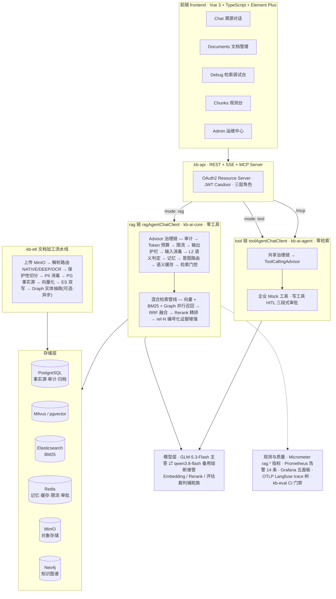

# kb-rag-agent · 企业知识库 RAG Agent 工作台

[](https://openjdk.org/projects/jdk/21/)
[](https://spring.io/projects/spring-boot)
[](https://spring.io/projects/spring-ai)
[](https://vuejs.org/)
[](https://www.typescriptlang.org/)
[](https://www.postgresql.org/)
[](https://milvus.io/)
[](https://www.elastic.co/elasticsearch)
[](https://redis.io/)
[](https://neo4j.com/)
[](./LICENSE)

基于 **Spring AI 2.0 GA** 构建的企业级 RAG 平台：文档加工流水线、混合检索（向量 + BM25 [+ Graph] 三路 RRF 融合）、带全链路溯源的 Agent 对话、评估门禁与运维闭环。

区别于 Dify / RAGFlow / MaxKB 等通用平台方案，本项目聚焦 Spring AI 生态内的三件事：**深度可溯源**（多路得分透明的检索调试台）、**企业权限集成**（Casdoor 认证 / 多租户 fail-closed 隔离 / 三层角色分级）、**运维闭环**（评估门禁 / 全链路审计 / 护栏体系 / 可观测性）——适合对审计与溯源有强需求、以 Java 为技术栈的企业。

> **项目状态**：Phase 1-4 已全部收官并通过用户侧验收；当前推进 Phase 5（收官阶段）——收尾清零 / 评估进化 / 语义缓存 / GraphRAG 四簇已收官，主答模型已切换 GLM-5.3-Flash，Agent 编排与产品化收尾推进中。能力矩阵见[阶段概览](#阶段概览)。

## 目录

- [核心特性](#核心特性)
- [架构概览](#架构概览)
- [项目结构](#项目结构)
- [快速开始](#快速开始)
- [配置参考](#配置参考)
- [安全体系](#安全体系)
- [质量与可观测](#质量与可观测)
- [API 概览](#api-概览)
- [阶段概览](#阶段概览)
- [文档](#文档)
- [License](#license)

## 核心特性

### 检索与生成

- 🔀 **混合检索三路融合**：向量 + BM25（+Graph）多路并行召回 → RRF 融合（K=60，N 路泛化）→ Rerank 精排（故障降级截断）；单路超时独立降级不拖垮全链
- 🕸️ **GraphRAG（可选）**：ETL 终态异步实体抽取（幂等重写 + 令牌桶限速 + 孤儿清扫），图路检索**零 LLM**（查询嵌入 → 实体向量匹配 → 1 跳展开 → chunk 反查）作为第三路入 RRF；`rag.graph.enabled` 缺省关，关闭态逐字节零回归
- 🧠 **意图路由与查询改写**：闲聊/元问题旁路直答（免检索零成本），知识问答走全链；多轮追问指代消解改写；路由与改写恒挂轻量模型，主模型切换不引起检索形态漂移
- 📌 **深度溯源**：证据编号化锚定（ref-N 契约）+ SSE TRACE 帧透传三路得分（向量/BM25/Graph）+ chunk 级「查看原文」；空证据显式拒答，不自由作答
- ⚡ **语义缓存（可选）**：Redis 8 内建搜索引擎（Redisson RSearch 零新增依赖），KNN 余弦 0.95 命中短路重放、溯源同形；文档级事件驱动失效；`rag.cache.enabled` 缺省关
- 🤖 **模型容灾**：主答 GLM-5.3-Flash ⇄ 备用模型熔断三态无锁切换，流式整段重发；异构备用自动重建 Prompt 屏障；`rag.routing.primary.provider` 一个环境变量切换主模型形态（glm/deepseek）

### Agent 与工具

- 🛠️ **双链路物理隔离**：`ragAgentChatClient`（纯检索零工具）与 `toolAgentChatClient`（纯工具零检索）按请求体 `mode: rag|tool` 显式分流——rag 链零工具 schema 注入，tool 链零检索成本，toolContext 通道物理消除凭证泄露面
- ✋ **HITL 人工审批**：企业 Mock 工具对齐真实 OA/ERP 契约，读工具自动执行、写工具三段式审批（挂起 → approve → 一次性消费），Redis 账本 TTL + 租户/用户绑定，故障 fail-closed
- 📡 **MCP Server**：Streamable HTTP `/mcp` 暴露三工具（search / get_document / ask），JWT 身份守卫 + scope 治理 + 独立限流桶；`ask` 全链复用 RAG 管线与护栏

### 安全与合规

- 🏢 **多租户 fail-closed 两层**：入口身份守卫（tenantId 缺失即拒）+ 检索器有上下文无租户返回空结果（多路零触达），全链路零例外
- 🛡️ **三段护栏**：输入消毒（NFKC 归一化 + PII 七类识别器掩码 + 注入词表拦截）→ L2 语义二判（可疑触发备用模型判定，fail-open 回落）→ 输出黑名单整段替换（流式聚合后验）；召回证据入生成前另有间接注入扫描（warn/exclude 双策略）
- 🔑 **三层权限分级**：普通用户 / 租户管理员（isAdmin）/ 系统超管（owner=built-in）——Casdoor JWT claims 直映射 Spring Security 角色，护栏词表等系统级资产超管独占
- 📜 **全链路审计**：三态落库（SUCCESS / REJECTED / ERROR，含被拒请求），query 脱敏、改写查询经装饰器捕获；用户反馈经 trace_id 回填审计行
- 🔏 **PII 治理**：七类独立识别器（手机/身份证/邮箱/银行卡/座机/车牌/IPv4），对话链 / ETL / 审计 / MCP / 入口日志同一实现源；每类型可独立开关

### 运维与质量

- 📈 **评估门禁（kb-eval）**：Golden Dataset 267 条三分区契约——干净集护栏零命中、注入防域拦截率分区阈值（L1 ≥95% / L2 ≥90%）、多跳问答专项集准确率门禁（≥80%）+ 三维质量门禁（答案完整度 / 引用准确率 / 幻觉率）；Judge 结构化输出剥壳容错，畸形不静默给分
- 🔁 **Bad Case 运营闭环**：审计日志多条件查询 → 根因四分类标注 → Golden Set 回灌（Git Ops 通道，幂等 upsert）→ CI 复跑验证——数据飞轮内建
- 📊 **全链路可观测**：17+ 项 `rag.*` 业务指标（Micrometer）+ Prometheus 14 条告警 + Grafana 五面板（含双供应商 SLA）+ Micrometer Observation → OTLP → Langfuse LLM trace 树（缺省关，零噪音）
- 🗂️ **Chunk 运维与索引重建**：Chunk 编辑（同源消毒 → 异步重嵌入 → ES 覆写）/ 软删 / 恢复 + 全量重建（PG 事实源重解析 + ES 孤儿清扫，任务表重启保留）
- 🧪 **压测资产（kb-loadtest）**：Gatling Java DSL 四场景——检索真压 / 生成桩压（内置纯 JDK 桩服务零计费）/ 真实 LLM TTFT·TPOT 采样 / SSE 并发会话
- 🏭 **生产形态**：Flyway 版本化迁移（schema.sql 双源守卫单测）+ 容器化（compose healthcheck / 自动重启 / AppCDS 训练服务）+ 灾备最小集（备份 + 恢复演练）+ 依赖扫描（OWASP dependency-check + CycloneDX SBOM）

## 架构概览



### 双链路与 Advisor 链序

安全与配额 Advisor 双链共享、物理隔离各自装配（order 即执行优先级）：

| 链 | Advisor 链（order） |
|---|---|
| **rag 链**（kb-ai-core） | AuditTrace(10) → TokenBudget(30) → RateLimit(100) → OutputGuardrail(110) → InputSanitize(300) → SemanticInjection(320) → Memory(400) → QueryRouting(440) → Trace(450) → CacheCheck(460，条件挂载) → RetrievalGate(500，内包检索管线) |
| **tool 链**（kb-ai-agent） | AuditTrace(10) → TokenBudget(30) → RateLimit(100) → OutputGuardrail(110) → InputSanitize(300) → SemanticInjection(320) → Memory(400) → ToolCallingAdvisor(1000) |

两条链共享：智能路由 ChatModel（主备容灾）、跨链会话记忆（同 sessionId 历史互通）、护栏与配额 Advisor、请求级 `RetrievalContext`（租户过滤 / 溯源 / 配额身份的参数链载体——不依赖 ThreadLocal，天然兼容流式异步线程切换）。

### 检索管线

```
查询 → 多轮改写 → ┌ 向量路（Milvus/pgvector，租户+软删过滤）
                  ├ BM25 路（Elasticsearch）            ╟ 并行 5s 超时单路降级
                  └ Graph 路（Neo4j，可选，零 LLM）
        → RRF 融合（K=60）→ Rerank 精排（qwen3-rerank，故障降级截断）
        → 间接注入扫描 → 编号化证据增强（ref-N 契约）→ 主答生成
```

## 项目结构

```
├── kb-commons/        # ApiResponse、BusinessException、PII 识别器注册表等共享组件
├── kb-domain/         # JPA Entity + Repository + 枚举 + schema.sql + Flyway 迁移
├── kb-infrastructure/ # 双向量库条件装配、MinIO、ES、文档解析客户端（DocMind/OCR）
├── kb-etl/            # ETL：解析路由 → 保护性切分 → 消毒 → PG → 向量化 → ES 双写；增量重入库
├── kb-ai-core/        # 纯 RAG 核心：多路检索 + RRF + 重排、Advisor 链（审计/护栏/配额/路由/门控/缓存）、记忆、指标
├── kb-ai-agent/       # Agent 事务域：Mock 工具 + HITL 审批账本 + MCP 三件套
├── kb-api/            # REST + SSE + MCP 端点 + SecurityConfig + JWT（启动入口）
├── kb-admin/          # 运维后台（Chunk 运维与重建 + Bad Case 闭环 + 护栏词表管理）
├── kb-eval/           # 评估：EvalRunner + 探针 + Golden Dataset 267 + CI 门禁
├── kb-loadtest/       # Gatling 压测四场景 + 生成桩（显式触发）
├── infra/             # 部署资产（docker-compose 应用/监控双栈 + .env 模板 + 备份脚本 + 告警规则）
├── frontend/          # Vue3 前端（Login + Chat 溯源对话 + Documents + Debug 检索调试台 + Chunks 观测台 + Admin 运维中心）
└── docs/              # 设计文档 + 进度追踪 + 交付文档 + 复盘优化
```

## 快速开始

### 前置条件

- **JDK 21+**（虚拟线程，父 POM 启用 `--enable-preview`）与 **Maven 4**
- **Node.js 18+**（前端）
- 基础设施：PostgreSQL 16+（需 pgvector 扩展）/ Milvus 或 pgvector / Elasticsearch / Redis（RSearch 能力，Redis Stack / Redis 8）/ MinIO；Neo4j 可选（仅 GraphRAG 开启时）
- 模型 API Key：GLM（或 DeepSeek，主答形态可切）+ 阿里云百炼 DashScope（Embedding / Rerank / 备用模型）
- [Casdoor](https://casdoor.org/) 实例（JWT issuer；用户字段 `owner` / `isAdmin` 直入 claims）

### 1. 构建后端

```bash
# 单模块构建须带 -am：兄弟模块不在本地仓库时单 -pl 解析失败
mvn -q --no-transfer-progress clean install -DskipTests
```

### 2. 配置环境变量（最小集）

```bash
export DB_URL=jdbc:postgresql://<host>:5432/kb_rag_agent
export DB_USERNAME=<user>
export DB_PASSWORD=<password>
export MINIO_ENDPOINT=http://<host>:9000
export KB_MILVUS_HOST=<host>
export JWT_ISSUER_URI=https://<casdoor-host>
export ZHIPU_API_KEY=sk-xxx        # GLM 主答（或 DEEPSEEK_API_KEY，主答形态见配置参考）
export DASHSCOPE_API_KEY=sk-xxx    # Embedding / Rerank / 备用模型
```

可选：`KB_VECTOR_STORE_PROVIDER=pgvector`（默认 milvus）、`ES_URIS`、`REDIS_HOST`、`SERVER_PORT`（默认 8080，按需覆盖）、观测开关 `TRACING_OTLP_ENABLED`、GraphRAG 开关 `RAG_GRAPH_ENABLED` + `NEO4J_*`。全量键与缺省值见 `kb-ai-core/src/main/resources/application-ai.yml` 与 `kb-infrastructure/src/main/resources/application-infra.yml`。

### 3. 启动

```bash
# 后端（spring-boot:run fork JVM 必须带 --enable-preview）
mvn spring-boot:run -pl kb-api -Dspring-boot.run.jvmArguments="--enable-preview"

# 前端（Vite dev server，经 .env BACKEND_URL 指向后端）
cd frontend && npm install && npm run dev
```

### 4. 验证

```bash
curl http://localhost:8080/actuator/health
# {"status":"UP",...}
```

浏览器打开前端（dev 缺省 `http://localhost:5173`）→ Casdoor 登录 → 上传文档 → 对话窗发起带溯源的知识问答。

### 生产部署

容器化形态：根 Dockerfile + `infra/docker-compose.app.yml`（healthcheck / 自动重启 / 日志轮转 / AppCDS 训练服务）+ `infra/docker-compose.monitoring.yml`（Prometheus / Grafana）+ `infra/.env.example` Secrets 模板。详见 `docs/delivery/运维手册.md`。

## 配置参考

功能面一切皆开关，缺省即最小形态：

| 配置键 | 缺省 | 说明 |
|---|---|---|
| `kb.vector-store.provider` | `milvus` | 向量库切换（milvus / pgvector），双向量库条件装配 |
| `rag.routing.primary.provider` | `glm` | 主答模型形态（glm / deepseek），一切即切 + 非法值启动失败 |
| `rag.routing.fallback.enabled` | `true` | 主备熔断路由（`false` = 单模型透传） |
| `rag.retrieval.rewrite.enabled` | `true` | 多轮查询改写（指代消解） |
| `rag.cache.enabled` | `false` | 语义缓存全族（关闭态零变化） |
| `rag.graph.enabled` | `false` | GraphRAG 全族（关闭态链形态逐字节不变） |
| `rag.guardrail.rules.source` | `file` | 护栏词表单轨（file = Git Ops 回滚阀门 / db = 运维台管理） |
| `rag.audit.enabled` | `true` | 全链路审计落库 |
| `tracing.otlp.enabled` | `false` | OTLP → Langfuse LLM trace（缺省零导出零噪音） |

## 安全体系

| 层 | 机制 |
|---|---|
| 认证 | OAuth2 Resource Server（JWT / Casdoor，前端 PKCE），全链无状态 |
| 授权 | 三层角色：普通用户 / 租户管理员（isAdmin）/ 系统超管（owner=built-in） |
| 租户隔离 | fail-closed 两层：入口身份守卫 + 检索器无租户即空结果 |
| 输入护栏 | NFKC 归一化 + PII 七类掩码 + 注入词表拦截（L1）+ 备用模型语义二判（L2） |
| 输出护栏 | 黑名单整段替换（流式聚合后验）+ PII 回显观察 |
| 间接注入 | 召回证据入生成前逐条扫描，warn / exclude 双策略 |
| 配额 | 租户日 Token 预算 + Redisson 每租户令牌桶限流（429） |
| 审计 | 三态异步旁路落库（含被拒请求），查询脱敏，trace_id 反馈回填 |
| 词表运营 | 新词默认 FLAG 观察零误伤、命中计数、热重载（pub/sub + 轮询回落）、带外导入（AI 零接触词面） |
| 平台加固 | CORS 白名单 / CSP / HSTS / 上传与请求体上限 / actuator 白名单 / OWASP dependency-check + CycloneDX SBOM |

## 质量与可观测

- **评估门禁三分区**（CI 退出码契约）：干净集护栏零命中 / 注入防域拦截率分区阈值（L1 ≥95%、L2 ≥90%）/ 观察集只报告；多跳专项集 30 例准确率门禁 ≥80%；三维质量门禁（AC ≥4.0 / CA ≥0.75 / HR ≤8%）
- **探针组**：`eval.probe` = auto / vector / hybrid / chain 四形态，A/B = 快照 + 内容盲比
- **业务指标**：`rag.feedback / retrieval / tool.call / token / routing / guardrail / request / rerank / cache.*` 等 17+ 计数族 + 双供应商 SLA 族（熔断/接管计数，供告警面板）
- **面板与告警**：Grafana 五面板（含 supplier-sla）+ Prometheus 告警 14 条（真触发自检 + promtool 合成单测）
- **LLM Trace**：Observation → otel bridge → OTLP Langfuse，双链 trace 合树（含流式主生成），内容捕获单源开关
- **压测四场景**：检索真压 / 生成桩压（零计费）/ 真实 LLM TTFT·TPOT / SSE 并发会话（Gatling Java DSL）

## API 概览

| 域 | 端点 | 权限 |
|---|---|---|
| 对话 | `POST /api/v1/chat`、`POST /api/v1/chat/stream`（SSE 主入口） | 全员 |
| 文档 | `/api/v1/documents`：上传 / 列表 / 详情 / chunks / 删除 / 重解析 / 替换 | 上传与读全员，治理写租户管理员 |
| 检索调试 | `POST /api/v1/retrieval/search`（三路得分透传） | 全员 |
| 会话与反馈 | `/api/v1/sessions`、`/api/v1/feedback` | 全员（租户+用户双过滤） |
| 工具审批 | `POST /api/v1/tools/approvals/{id}/approve` | 全员 |
| 统计 | `GET /api/v1/stats/overview`、`/documents/processing` | 全员 |
| 运维 | `/api/v1/admin/**`：Chunk 运维 / 索引重建 / 审计查询 / Bad Case 闭环 | 租户管理员 |
| 护栏词表 | `/api/v1/admin/guardrail/**`：CRUD / reload / 命中演练 | 系统超管 |
| MCP | `/mcp`（Streamable HTTP，search / get_document / ask 三工具） | JWT |
| 健康检查 | `/actuator/health` | 公开 |

完整请求/响应契约、SSE 事件协议与错误码映射见 [API 文档](docs/delivery/API文档.md)。

## 阶段概览

| 阶段 | 范围 | 状态 |
|---|---|---|
| Phase 1 | MVP 闭环：上传 → 解析 → 切分 → 向量化 → RAG 对话 + Casdoor 认证 | ✅ |
| Phase 2 | 模块化混合检索（双路+RRF+重排）、来源溯源、解析路由升级（DocMind/OCR）、多轮记忆 | ✅ |
| Phase 3 | 护栏配额、租户隔离、审计、反馈闭环、意图路由、双链路拆分（rag/tool）、评估门禁 | ✅（17 项） |
| 优化冲刺 | 六簇：流式计账/熔断加固、检索调优 A/B、语境增强、Bad Case 治理、护栏加固、增量重入库 | ✅ |
| 安全加固专项 | 六簇：词表工程、平台层零缺口、PII 注册表化、间接注入闭环、L2 语义判定、词表运营与对抗自动化 | ✅ |
| Phase 4 | 七簇：观测地基 / 面板统计 / Chunk 运维与索引重建 / Bad Case 运营闭环 / MCP Server 产品化 / 生产加固压测 / 文档与格式收尾 | ✅ 全阶段收官（用户侧验收通过） |
| Phase 5 | 六簇：收尾清零 / 评估进化 / 语义缓存 / GraphRAG / Agent 编排 / 产品化收尾 + 模型层批B | 🔄 ①-④ + 模型层（GLM-5.3-Flash）已收官，⑤⑥ 推进中 |

## 文档

- [全景实现报告（按章拆分，设计唯一依据）](docs/project-implement/README.md)——含历次修订注记（各章头部版本递增）
- [交付文档三件套](docs/delivery/README.md)——运维手册 / API 文档 / 用户使用手册
- [进度追踪（按任务行定位）](docs/project-progress/项目阶段推进任务清单完成记录.md)
- [用户侧待执行项清单](docs/project-progress/用户侧待执行项清单.md)
- [Phase 4 复审与规划方案（调研实证版）](docs/project-optimization/Phase%204%20复审与规划方案（调研实证版）.md)
- [Phase 5 复审与规划方案（调研实证版）](docs/project-optimization/Phase%205%20复审与规划方案（调研实证版）.md)

## License

[MIT](./LICENSE)
