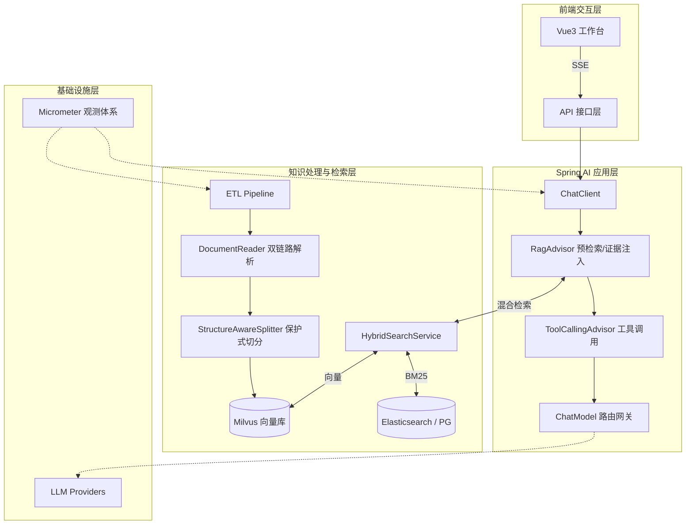

# 基于 Spring AI 2.0 的企业知识库 RAG Agent 工作台全景实现分析报告

## 1. 项目基本信息

- **项目名称**：企业知识库 RAG Agent 工作台与知识库助手
- **技术栈**：Java 21 + Spring Boot 4.0 + Spring AI 2.0 + Milvus + PostgreSQL + Vue3
- **核心定位**：解决企业非结构化知识管理痛点，提供高准确率、可溯源、可运维的企业级 AI 知识问答平台。

## 2. 项目全局概览与战略定位

传统企业知识管理面临文档格式杂乱、表格/图片解析困难、纯向量检索命中率不稳（尤其针对专有名词）、回答缺乏依据不可信等痛点。本项目战略定位为**可解释、可运维的 AI 知识中枢**：

- 不止于“能回答”，更要求“答得准”（混合检索）、“答得有依据”（来源溯源）。
- 不止于“算法模型”，更强调“工程闭环”（从文档解析到前端可视化调试）。
- 利用 Spring AI 2.0 的标准化抽象与 Advisor 机制，构建低耦合、易扩展的现代 AI 架构。

## 3. 业务需求详细清单

1. **知识采编需求**：支持 PDF、Docx、Markdown、TXT 等多格式文档上传，需自动处理扫描件、图片、复杂表格。
2. **知识精准检索需求**：针对课程名、专业术语、字段名等，纯语义检索易丢失关键词，需支持关键词+语义的混合检索。
3. **可信问答需求**：用户提问后，系统必须基于知识库事实回答，拒绝幻觉，且必须附带原文出处（文件名、页码）。
4. **多轮对话需求**：支持上下文连贯的流式问答体验。
5. **运维管控需求**：管理员需能查看 Chunk 切分情况，支持编辑、删除无效 Chunk，重建索引，查看问答全链路日志。

## 4. 核心功能详细清单

1. **分层知识管理**：Document（文档主数据） -> Section（章节） -> Chunk（切片） -> Vector（向量副本）四级解耦。
2. **双链路文档解析**：原生解析与 OCR 智能识别结合，基于文本密度动态路由。
3. **半结构化保护式切分**：保护 `<table>`、`` 等 HTML 块，防止结构破坏。
4. **混合检索体系**：Milvus 向量检索 + 应用层/ES BM25 检索 + RRF 融合排序。
5. **Prefetch 证据注入**：Agent 生成前强制检索证据并注入上下文。
6. **来源溯源输出**：返回答案及 `chunk_id`、文件名、页码、各路检索得分。
7. **工作台可视化运维**：前端支持文档管理、Chunk 观测、检索调试、Agent 对话与历史会话查看。

## 5. 系统架构设计

基于 Spring AI 2.0 最佳实践，系统采用分层架构与事件驱动模型：



## 6. 数据库与数据架构设计

采用多模态数据库协同，体现分层解耦：

- **PostgreSQL (关系型主库)**：
    - `app_document`：文档元数据（文件名、状态、上传时间）。
    - `app_section`：章节信息。
    - `app_chunk`：切片主数据（包含 `chunk_id`, `section_id`, `content`, `page_num`, `type`[text/table/image]）。
    - `app_chat_log`：问答日志（含检索的 chunk_ids、耗时、Token 消耗）。
- **Milvus (向量副库)**：
    - 存储 `chunk_id` 对应的 `embedding` 向量及过滤元数据（`doc_id`, `type`）。确保向量库只管“算”，关系库管“元数据”。
- **Redis**：
    - 存储多轮会话上下文。

## 7. 核心功能实现方案

### 7.1 双链路文档解析与半结构化保护式切分

**技术方案**：利用 Spring AI 的 `DocumentReader` 与自定义 `DocumentTransformer`。

1. **动态路由解析**：实现 `SmartDocumentReader`，内部代理 `TikaDocumentReader`（原生）与外部 OCR API。读取前几页计算文本密度，若低于阈值，走 OCR 路径，将图片/表格转为带 `<table>` 标签的 HTML 文本。
2. **保护式切分**：继承 `TokenTextSplitter`，重写切分逻辑。利用正则识别 `<table>...</table>` 块，将其作为不可分割的整体 Chunk，仅对剩余文本按 Token 切分。

```java
// Spring AI 2.0 保护式切分核心实现示例
public class StructureAwareTextSplitter implements DocumentTransformer {
    @Override
    public List<Document> apply(List<Document> documents) {
        List<Document> chunks = new ArrayList<>();
        for (Document doc : documents) {
            String content = doc.getText();
            // 匹配 HTML 表格块
            Pattern pattern = Pattern.compile("(<table>.*?</table>)", Pattern.DOTALL);
            Matcher matcher = pattern.matcher(content);
            int lastEnd = 0;
            while (matcher.find()) {
                // 先切表格前的普通文本
                if (matcher.start() > lastEnd) {
                    chunks.addAll(splitText(content.substring(lastEnd, matcher.start()), doc.getMetadata()));
                }
                // 表格作为一个整体 Chunk 保留
                chunks.add(new Document(matcher.group(), doc.getMetadata()));
                lastEnd = matcher.end();
            }
            // 切剩余文本
            if (lastEnd < content.length()) {
                chunks.addAll(splitText(content.substring(lastEnd), doc.getMetadata()));
            }
        }
        return chunks;
    }
}
```

### 7.2 混合检索体系 (Milvus + BM25 + RRF)

**技术方案**：Spring AI 2.0 的 `VectorStore` 抽象支持多数据源，但在混合检索中，最佳实践是在应用层封装 `HybridSearchService`。

1. **并行召回**：使用 Java 21 虚拟线程并发调用 Milvus（语义召回 Top-K）和 Elasticsearch/PG 全文检索（BM25 召回 Top-K）。
2. **RRF 融合排序**：对两路结果基于公式 `score = 1 / (k + rank)` 进行融合重排，解决纯向量检索对专有名词命中率低的问题。

```java
@Service
public class HybridSearchService {
    
    @Autowired VectorStore milvusVectorStore; // Spring AI 自动装配
    @Autowired FullTextSearchRepository bm25Repo;
    public List<ChunkResult> hybridSearch(String query, int topK) {
        // 并行检索
        var vectorResults = milvusVectorStore.similaritySearch(SearchRequest.query(query).withTopK(topK));
        var bm25Results = bm25Repo.search(query, topK);
        
        // RRF 融合逻辑
        Map<String, Double> rrfScores = new HashMap<>();
        int k = 60; // RRF 常数
        calculateRrf(vectorResults, rrfScores, k);
        calculateRrf(bm25Results, rrfScores, k);
        
        // 返回带融合分的排序结果
        return rrfScores.entrySet().stream()
            .sorted(Map.Entry.<String, Double>comparingByValue().reversed())
            .limit(topK)
            .map(/* 组装 ChunkResult 包含 chunk_id, 向量分, bm25分, 融合分 */)
            .collect(Collectors.toList());
    }
}
```

### 7.3 Prefetch 证据注入与 Agent 对话链路

**技术方案**：利用 Spring AI 2.0 的 `Advisor` 机制，实现请求拦截与上下文增强，而非硬编码在业务逻辑中。

1. **自定义 `RagAdvisor`**：在 `aroundCall` 阶段，拦截用户请求。调用 `HybridSearchService` 获取证据，将其拼接至 System Prompt 中，实现强制证据注入。
2. **流式输出**：通过 `ChatClient.prompt().stream()` 返回 SSE 流，前端实时渲染。

```java
public class RagAdvisor implements BaseAdvisor {
    
    @Autowired HybridSearchService searchService;
    @Override
    public AdvisedResponse aroundCall(AdvisedRequest advisedRequest, CallAroundAdvisorChain chain) {
        String userInput = advisedRequest.userText();
        
        // 1. Prefetch 预检索
        List<ChunkResult> evidences = searchService.hybridSearch(userInput, 5);
        
        // 2. 构建证据上下文
        String context = evidences.stream()
            .map(c -> "[来源:"+c.getDocName()+"-P"+c.getPageNum()+"] " + c.getContent())
            .collect(Collectors.joining("\n"));
            
        // 3. 增强原请求的 System Prompt
        String enhancedSystemPrompt = advisedRequest.systemText() + 
            "\n\n请严格基于以下参考资料回答问题，并附注来源：\n" + context;
            
        AdvisedRequest newRequest = AdvisedRequest.from(advisedRequest)
            .withSystemText(enhancedSystemPrompt)
            .build();
            
        return chain.nextAroundCall(newRequest);
    }
}
```

### 7.4 来源溯源输出与工作台可视化

**技术方案**：利用 Spring AI 2.0 结构化输出能力。

1. **结构化实体定义**：定义 `AgentResponse` record，包含 `answer` (正文) 和 `sources` (命中的 `List<SourceInfo>`，含 `chunk_id`, `file_name`, `page_num`)。
2. **Advisor 传递元数据**：在 `RagAdvisor` 中将检索到的 `evidences` 暂存至 Advisor 上下文，在响应组装时取出，配合 `.entity()` 完成结构化输出。

## 8. 非功能性需求实现方案

1. **可观测性**：利用 Spring Boot Actuator + Micrometer。开启 `spring.ai.observations.enabled=true`，监控 LLM 调用耗时、Token 消耗、向量检索成功率。问答日志全量异步落库 `app_chat_log`。
2. **安全护栏**：实现 `SafetyGuardrailAdvisor`，前置校验用户输入防 Prompt 注入，后置校验输出防敏感信息泄露。
3. **性能保障**：大文件解析采用异步任务（消息队列解耦），前端轮询或 WebSocket 获取解析进度。向量检索利用 Milvus 分区机制提升速度。

## 9. 研发工程化方案

1. **代码结构**：采用 DDD（领域驱动设计）分层，`ai-core`（Spring AI 配置与 Advisor）、`knowledge-domain`（文档/Chunk 领域模型）、`application`（应用服务）、`interfaces`（REST 接口）。
2. **测试策略**：单元测试使用 EasyMock/Mockito 模拟 LLM 响应与向量库；集成测试使用 Testcontainers 启动 PG 和 Milvus，确保环境一致性。
3. **AI 评估体系**：建立测试集（Golden Dataset），在 CI/CD 流程中引入自动化评估脚本，检查答案的准确率与召回率，防止 Prompt 修改导致回归。

## 10. 部署与运维方案

1. **容器化部署**：Dockerfile 采用多阶段构建，打包 JRE 环境。通过 `docker-compose.yml` 编排 Spring Boot 应用、PostgreSQL、Redis、Milvus 及 Elasticsearch。
2. **配置管理**：模型 API Key、端点等通过 Kubernetes Secrets 或环境变量注入，不同环境（开发/测试/生产）使用不同 Profile。
3. **CI/CD**：基于 GitLab CI / GitHub Actions，代码合并触发自动化测试，构建镜像推送至私有仓库，通过 ArgoCD 滚动发布。

## 11. 项目实施步骤与路线

项目建议分三期敏捷迭代，稳步推进：

- **Phase 1: 知识基建与解析闭环 (2周)**
    - 搭建 Spring Boot 4 + Spring AI 2.0 基础骨架。
    - 实现文档上传、双链路解析、半结构化保护切分。
    - 完成 Milvus 向量库对接，实现单路向量检索 API。
- **Phase 2: 混合检索与 RAG 对话 (2周)**
    - 引入 BM25 检索，实现 RRF 融合排序。
    - 开发 `RagAdvisor`，实现证据注入与多轮流式对话。
    - 完成结构化输出，前端 Vue3 完成工作台基础对话界面联调。
- **Phase 3: 运维管控与可观测性 (2周)**
    - 实现文档管理、Chunk 可视化编辑/删除/重建索引。
    - 接入问答日志落库，前端实现检索调试面板（展示各路得分与召回片段）。
    - 完善安全护栏与监控面板，上线试运行。

## 12. 质量保障与交付标准

1. **功能完整性**：支持 PDF(含扫描件)、Docx、Md 格式；表格结构解析破损率 < 5%；专有名词/标题命中率达 95% 以上。
2. **性能指标**：单文档（100页）解析入库时间 < 2分钟；单次问答响应延迟 P95 < 3秒（流式首 Token < 1秒）。
3. **可解释性**：前端能完整展示 Agent 回答依据的 Chunk 原文、页码及各阶段检索得分。
4. **文档交付**：包含架构设计文档、API 接口文档、部署运维手册及用户使用手册。

通过以上技术方案与实施路线，借助 Spring AI 2.0 强大的抽象与编排能力，您可以将原本复杂的 Python 算法逻辑转化为标准、易维护的 Java 工程化实现，高质量交付该企业级知识库项目。


